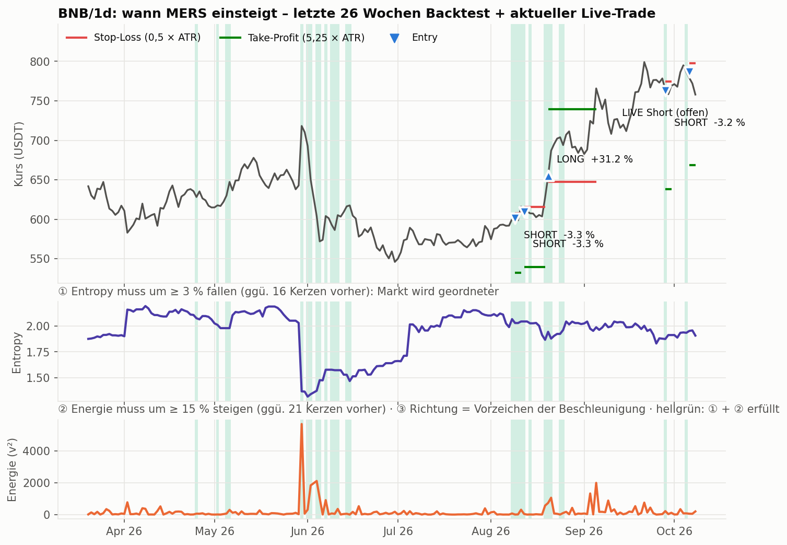
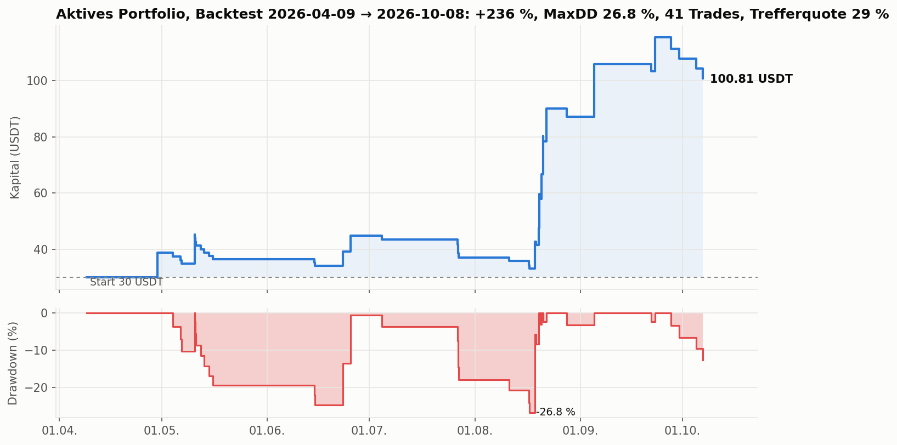
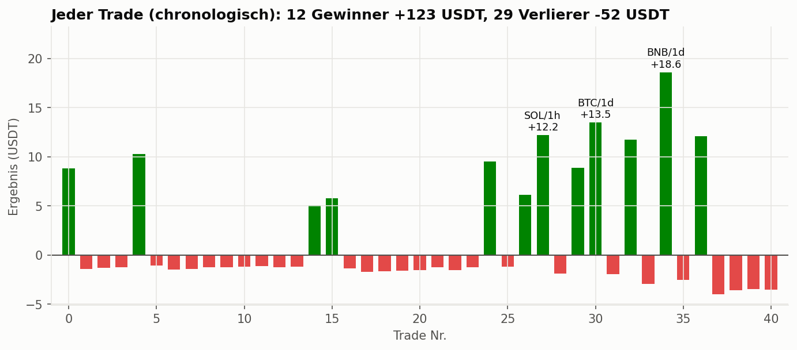
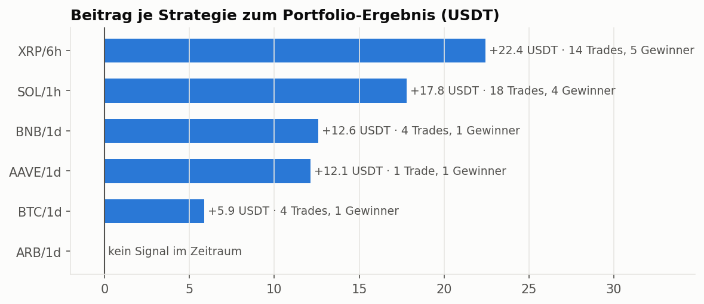
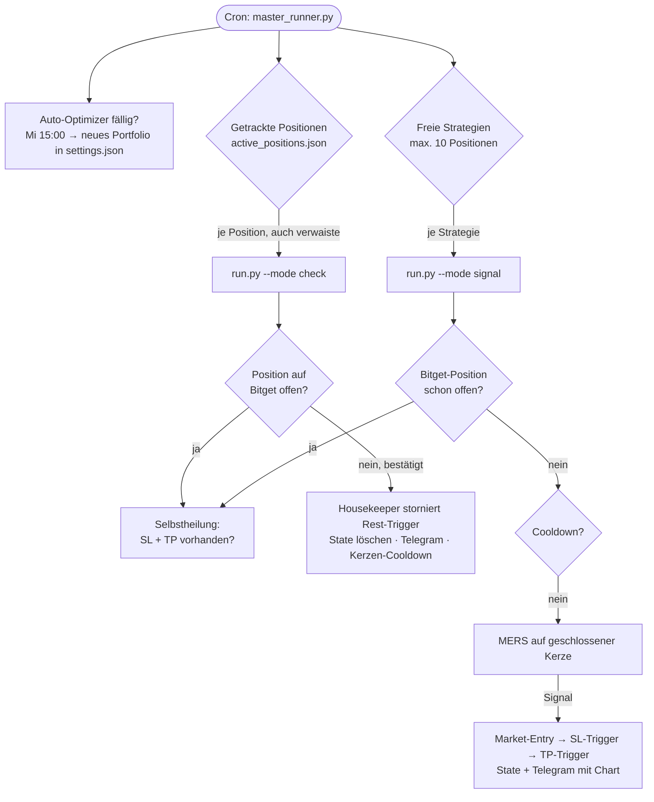
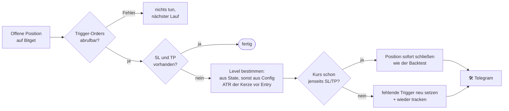
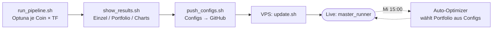

# ⚡ mbot – MERS Momentum-Bot (Entropy · Energie · Beschleunigung)

<div align="center">


[](https://www.python.org/)
[](https://github.com/ccxt/ccxt)
[](https://www.bitget.com/)
[](https://optuna.org/)

**Steigt ein, wenn ein Markt geordneter wird und gleichzeitig Schwung aufbaut – Long oder Short,
mit engem Stop-Loss, weitem Take-Profit und Risiko-basierter Positionsgröße. Mehrere Strategien parallel.**

[Stand](#-stand-2026-10-08) • [Strategie](#-die-strategie) • [Ergebnisse](#-ergebnisse) • [Live-Ablauf](#-live-ablauf) • [Selbstheilung](#️-selbstheilung-sltp) • [Installation](#-installation) • [Workflow](#-workflow) • [Wartung](#-wartung)

</div>

---

## 📌 Stand (2026-10-08)

| Baustein | Einstellung |
|---|---|
| Signal | **MERS**: Entropy fällt **und** Energie steigt → Richtung aus der Beschleunigung |
| Portfolio | **6 Strategien**: XRP/6h · SOL/1h · AAVE/1d · BTC/1d · ARB/1d · BNB/1d |
| Gleichzeitig offen | bis zu **10 Positionen** (`max_open_positions`), jedes Symbol nur einmal |
| Größe | **Risiko-basiert**: 2,75–7 % des Kontos Verlust bis zum SL, Hebel 4–17× (je Config) |
| Exit | nur harter **SL/TP** auf Bitget (ATR-basiert), kein vorzeitiger Ausstieg – wie im Backtest |
| Portfolio-Auswahl | Auto-Optimizer jeden **Mittwoch 15:00**, rollendes Fenster der letzten **26 Wochen** |
| Backtest 09.04.–08.10.2026 | 30 → **100,81 USDT (+236 %)**, MaxDD **26,8 %**, 41 Trades, Trefferquote **29 %** |
| Schutz | **Selbstheilung**: offene Position ohne SL/TP wird erkannt und neu abgesichert (seit `6ab62da`) |

> ⚠️ Die Trefferquote liegt unter 30 %. Der Bot lebt von wenigen großen Gewinnern – lange Verlustserien sind normal
> und kein Defekt. Siehe [Risiken](#️-risiken).

---

## 🤖 Die Strategie



mbot liest keine Kerzenmuster oder gleitenden Durchschnitte. Er misst bei jeder **geschlossenen** Kerze drei
Dinge, die zusammen einen Trendstart beschreiben:

| # | Frage | Messgröße | Bedingung |
|---|---|---|---|
| ① | Wird der Markt **geordneter**? | Shannon-Entropy der Log-Renditen, `H = −Σ pᵢ·log pᵢ` | `H` fällt um ≥ `min_entropy_drop_pct` ggü. `entropy_lookback` Kerzen vorher |
| ② | Baut sich **Schwung** auf? | Energie `E = v²` mit `v(t) = p(t) − p(t−1)` | `E` steigt um ≥ `min_energy_rise_pct` ggü. `energy_lookback` Kerzen vorher |
| ③ | In welche **Richtung**? | Beschleunigung `a(t) = v(t) − v(t−1)` | `a > 0` → **Long**, `a < 0` → **Short** |

Hohe Entropy heißt: Die Renditen sind bunt gemischt, der Markt choppt. Fällt sie, werden die Bewegungen
gleichförmiger – ein Trend formt sich. Steigt zugleich die Energie, kommt echter Schub dazu statt bloßer Drift.

### Optionale Filter (pro Config von Optuna an- oder abgeschaltet)

| Layer | Filter | Wirkung |
|---|---|---|
| Regime | Phasenraum `(p, v, a)` → `trend` / `range` / `chaos` | `chaos` blockiert immer, `range` nur mit `allow_range_trade` |
| Multi-TF | `sign(p(t) − p(t−T))` auf Mikro-, Meso-, Makro-Skala | nur Einstieg, wenn alle drei in Signalrichtung zeigen |
| Volumen | Volumen / Ø 20 Kerzen | nur Einstieg bei Volumen ≥ `min_vol_ratio` |
| FFT | dominante Zyklusperiode | nur informativ (Telegram), kein Filter |

### Stop-Loss, Take-Profit und Größe

```
Long:  SL = Entry − atr_sl_mult × ATR      TP = Entry + atr_tp_mult × ATR
Short: SL = Entry + atr_sl_mult × ATR      TP = Entry − atr_tp_mult × ATR

Kontrakte = (Kontostand × risk_per_trade_pct %) / |Entry − SL|     (gedeckelt durch Margin × Hebel)
```

Die aktiven Configs nutzen fast alle einen **sehr engen SL (0,5 × ATR)** und einen **weiten TP (2,75–5,5 × ATR)**.
Ein Treffer bringt so ein Vielfaches dessen, was ein Fehlsignal kostet – im Bild oben: drei kleine Verluste
von je ≈ −3 % und ein Long mit **+31 %**.

| Strategie | Risiko/Trade | Hebel | SL × ATR | TP × ATR | Filter |
|---|---|---|---|---|---|
| XRP/6h | 2,75 % | 17× | 0,5 | 2,75 | – |
| SOL/1h | 2,75 % | 8× | 0,5 | 5,5 | – |
| AAVE/1d | 7,0 % | 4× | 2,25 | 5,0 | Regime |
| BTC/1d | 3,0 % | 10× | 0,5 | 5,5 | Regime + Multi-TF |
| ARB/1d | 3,0 % | 14× | 0,75 | 2,0 | – |
| BNB/1d | 3,0 % | 10× | 0,5 | 5,25 | – |

---

## 📈 Ergebnisse

Backtest des **aktiven Portfolios** im gemeinsamen Kapitaltopf, genau so, wie ihn der Auto-Optimizer rechnet
(Gebühren 0,06 % je Seite, SL/TP-Reihenfolge innerhalb einer Kerze über feinere Kerzen aufgelöst):



Vier Monate lang passiert wenig, dann tragen ein paar Trades im August/September fast das ganze Ergebnis.
Genau dieses Muster zeigt auch die Einzelansicht:





> Die Parameter der Configs stammen aus März/April 2026 – der Zeitraum danach ist für sie **ungesehen**.
> Die **Auswahl** der 6 Strategien hat der Optimizer aber auf genau diesen 26 Wochen getroffen; die Zahlen sind
> damit eher eine Obergrenze als eine Prognose.

---

## 🔄 Live-Ablauf

Cron startet `master_runner.py` alle paar Minuten. Jede Strategie läuft als eigener Prozess (`run.py`):



Wichtige Regeln, die aus echten Live-Vorfällen stammen:

- **Exchange-Wahrheit statt lokaler Liste.** Positionen werden geprüft, auch wenn ihre Strategie nicht mehr im
  Portfolio ist (sonst bleiben Geister-Trigger stehen).
- **„Unbekannt“ ist nie „leer“.** Schlägt der Positions- oder Markt-Abruf fehl, bricht der Zyklus ab – er
  storniert nichts und löscht keinen State. Der nächste Cron-Lauf versucht es erneut.
- **Ein Symbol, eine Position.** Vor jedem Entry wird die echte Bitget-Position geprüft, nicht nur der lokale State.

---

## 🛡️ Selbstheilung SL/TP

SL und TP sind zwei getrennte Trigger-Orders (kein OCO). Am 07.10.2026 hat ein fehlgeschlagener Markt-Abruf
dazu geführt, dass der Bot einen offenen BNB-Short für geschlossen hielt und **beide Schutz-Orders stornierte**.
Seitdem prüft jeder Zyklus aktiv, ob jede offene Position wirklich geschützt ist:



Live verifiziert am BNB-Short: SL **797,34** und TP **668,49** wurden neu gesetzt (Original 797,49 / 668,64),
ein zweiter Lauf setzte nichts doppelt.

---

## 💬 Telegram

| Ereignis | Nachricht |
|---|---|
| Neuer Trade | `🚀 mbot SIGNAL` mit Richtung, Entry, SL/TP in %, R:R, Hebel, Risiko in USDT + Chart |
| Trade geschlossen | `✅ mbot TRADE GESCHLOSSEN` mit Entry, SL, TP, Haltebeginn |
| Schutz repariert | `🛠️ mbot Selbstheilung` – was fehlte und was neu gesetzt bzw. geschlossen wurde |
| Optimizer | `🔍 GESTARTET` und `✅ abgeschlossen` mit neuem aktivem Portfolio |
| Absturz | kritischer Alarm aus dem `guardian`-Decorator |

---

## 🧰 Installation

**Voraussetzungen:** Python 3.10+, Git, Bitget-Account mit Futures-API, Telegram-Bot ([@BotFather](https://t.me/BotFather)).

```bash
git clone https://github.com/Youra82/mbot.git
cd mbot
chmod +x install.sh && bash ./install.sh      # legt .venv/, logs/, artifacts/tracker/ an
nano secret.json
```

```json
{
    "mbot": [{"name": "Account-1", "apiKey": "...", "secret": "...", "password": "..."}],
    "telegram": {"bot_token": "...", "chat_id": "..."}
}
```

> `password` ist die Bitget-**Passphrase** des API-Keys, nicht das Login-Passwort.
> Der Key sollte nur von mbot benutzt werden – `cancel_all_orders` wirkt auf alle Orders eines Symbols.

Cronjob (VPS):

```cron
*/5 * * * * /usr/bin/flock -n /home/<user>/mbot/mbot.lock /bin/sh -c "cd /home/<user>/mbot && .venv/bin/python3 master_runner.py >> logs/cron.log 2>&1"
```

---

## 🔧 Workflow



| Schritt | Befehl | Ergebnis |
|---|---|---|
| Optimieren | `./run_pipeline.sh` | `src/mbot/strategy/configs/config_<SYMBOL>_<TF>_mers.json` |
| Auswerten | `./show_results.sh` | 1) Einzel-Analyse · 2) manuelles Portfolio · 3) Auto-Portfolio · 4) interaktive Charts |
| Tests | `./run_tests.sh` | Pytest-Sicherheitscheck |
| Configs pushen | `./push_configs.sh` | Commit + Push der Configs |
| Portfolio sofort neu wählen | `.venv/bin/python3 auto_optimizer_scheduler.py --force` | neues `active_strategies` + Telegram |
| Charts neu ohne Optimierung | `.venv/bin/python3 run_portfolio_optimizer.py --replot` | Equity-HTML + Trades-Excel per Telegram |
| Chart-Vorschau ohne Trade | `.venv/bin/python show_chart.py --symbol SOL/USDT:USDT --timeframe 1h` | Kerzenchart mit Entry/SL/TP |

### Optimizer – Suchraum (Optuna)

| Parameter | Bereich | | Parameter | Bereich |
|---|---|---|---|---|
| `entropy_window` | 10–60 | | `atr_period` | 7–28 |
| `entropy_lookback` | 3–25 | | `atr_sl_mult` | 0,5–3,0 |
| `energy_lookback` | 3–25 | | `atr_tp_mult` | SL + 0,5 … 6,0 |
| `min_entropy_drop_pct` | 0,01–0,35 | | `use_regime_filter` / `allow_range_trade` | 0 / 1 |
| `min_energy_rise_pct` | 0,05–1,50 | | `regime_window` | 10–40 |
| `leverage` | 5–20 | | `use_multitf_filter` (`meso`/`macro_tf_mult`) | 0 / 1 |
| `risk_per_trade_pct` | 0,5–3,0 % | | `use_volume_filter` (`min_vol_ratio` 0,5–2,5) | 0 / 1 |

---

## 🗂️ Architektur

```
mbot/
├── master_runner.py              # Cron-Orchestrator: check für alle Positionen, signal für freie Strategien
├── auto_optimizer_scheduler.py   # Mittwochs Portfolio-Auswahl (26 Wochen rollend)
├── run_portfolio_optimizer.py    # Backtests aller Configs + Greedy-Portfolio → settings.json
├── run_pipeline.sh / show_results.sh / push_configs.sh / update.sh / install.sh
├── settings.json                 # Portfolio, Risiko-Defaults, Optimizer-Zeitplan
├── secret.json                   # API-Keys + Telegram (nicht in Git)
├── artifacts/tracker/            # active_positions.json, candle_cooldowns.json (nicht in Git)
├── docs/readme/                  # Grafiken dieser README
└── src/mbot/
    ├── strategy/  mers_signal.py · mdef_analysis.py · run.py · configs/
    ├── analysis/  backtester.py · optimizer.py · portfolio_simulator.py · interactive_chart.py
    └── utils/     exchange.py · trade_manager.py (Entry, SL/TP, Housekeeper, Selbstheilung) · telegram.py · guardian.py
```

---

## 🩺 Wartung

```bash
./show_status.sh                                   # Positionen, Configs, Logs auf einen Blick
tail -f logs/master_runner.log                     # Orchestrator
tail -f logs/mbot_BNBUSDTUSDT_1d.log               # eine Strategie
cat artifacts/tracker/active_positions.json        # was der Bot gerade verfolgt
./update.sh                                        # Git-Stand holen (secret.json bleibt erhalten)
```

> `update.sh` setzt das Repo hart auf `origin/main` zurück. Das Portfolio in `settings.json` kommt damit
> aus GitHub – Änderungen nur auf dem VPS gehen beim nächsten Update verloren.

---

## ⚠️ Risiken

- **Wenige Gewinner tragen alles.** Bei ~29 % Trefferquote sind 10+ Verluste in Folge im Backtest normal. Wer
  in einer Verlustserie abschaltet, verpasst den Trade, der sie bezahlt.
- **Auswahl-Optimismus.** Das Portfolio wird auf denselben 26 Wochen gewählt, die oben gezeigt werden.
- **Kleine Stichprobe.** 41 Trades in 26 Wochen; AAVE/1d hatte 1 Trade, ARB/1d keinen.
- **Enger SL mit Hebel.** 0,5 × ATR wird oft vom Rauschen getroffen; Slippage am SL ist im Backtest nur pauschal enthalten.
- **Getrennte Trigger statt OCO.** Schutz hängt an zwei Orders – deshalb die Selbstheilung.

> **Disclaimer:** Experimentelle Software zu Forschungszwecken. Der Handel mit Krypto-Derivaten kann zum
> Totalverlust führen. Nutzung auf eigene Gefahr.

---

## 📦 Abhängigkeiten

`ccxt==4.3.5` · `pandas==2.1.3` · `numpy` · `ta==0.11.0` · `optuna==4.5.0` · `requests==2.31.0` · `plotly` · `openpyxl` · `matplotlib` · `pytest`
